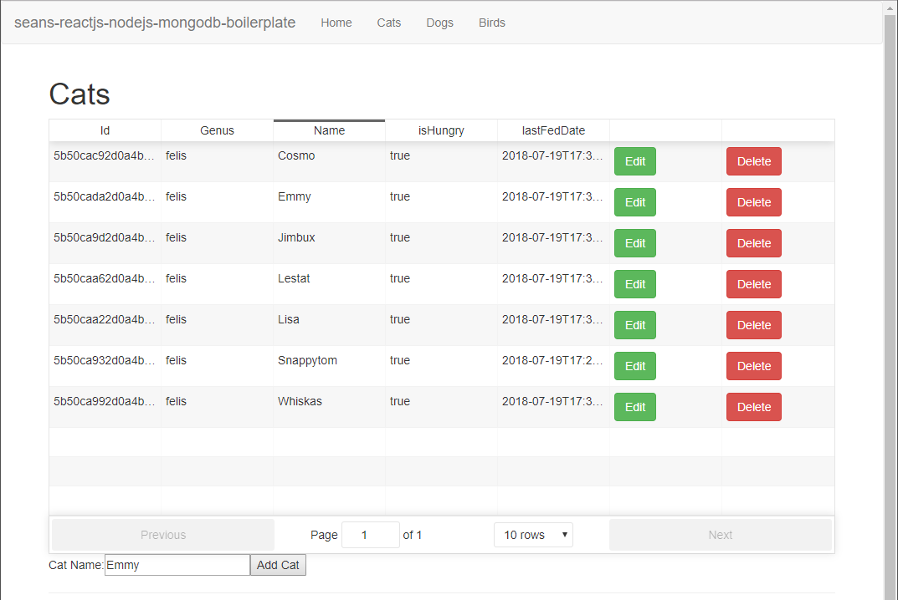
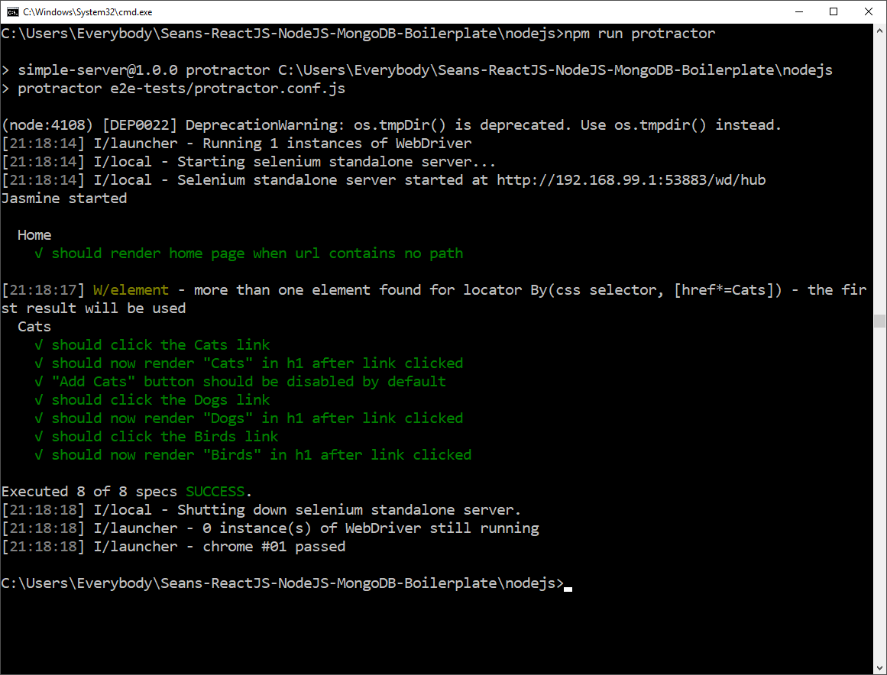

# Seans ReactJS NodeJS MongoDB Boilerplate

*Comes Dockerised and with Tests*

## To start

`docker-compose up`

then visit

`https://localhost:8443`

## Note about docker toolbox on windows 10

1st, Download this repository to your c:/users/[useraccount] folder to minimise issues caused by docker shared folder access.
Then after running `docker-compose up`, the site will be available at `https://192.168.99.100:8443`
You can change this to `https:/localhost:8443` by following these steps below.

* Open VBox manager,
* Click the default machine used by docker
* Right click and choose Settings
* Network > Adapter 1 > Advanced > Port Forwarding
* Click "+" to add a new Rule
* Set Host IP to 127.0.0.1, Host Port 8443
* Guest IP to 192.168.99.100 and Guest Port 8443
* https:/localhost:8443

## To Test

Contains mocha, chai and enzyme tests

`cd nodejs`

`npm test`

## Protractor e2e tests

There is also the option to do e2e testing with protractor and jasmine.

Before you start, you need to install protractor

`cd nodejs`

`npm install -g protractor`

then, update the web driver

`npm run update-webdriver`

Now you can run

`npm run protractor`

